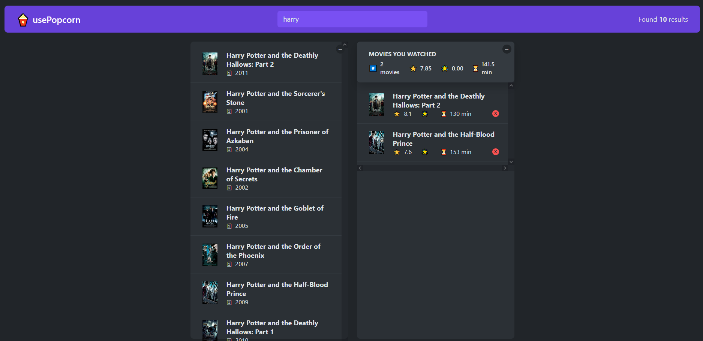

# UsePopConr project

This was a simple project using the TMDB API  

All the components are inside the App.js for easier understanding, since it is a simple course project.

1. API calls
2. Totally reusable ReactJS components
3. Error handling
4. Hooks

## Prints

Seach and view movie

 

Favorites

